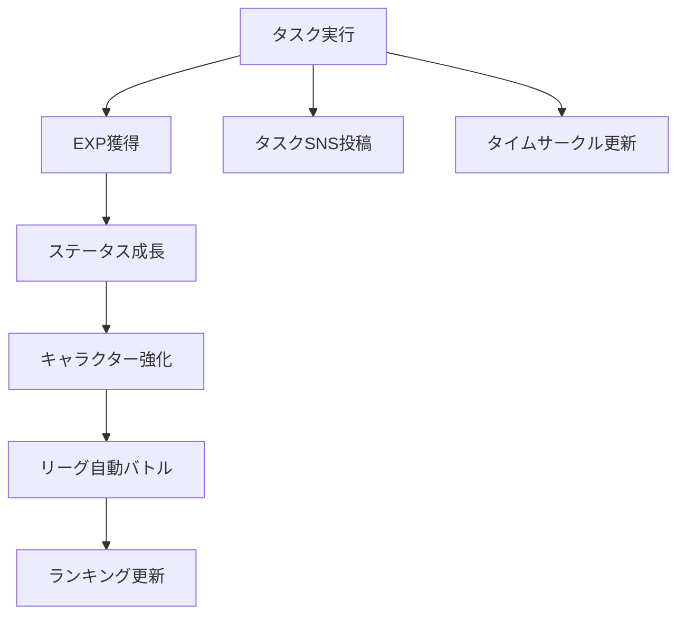
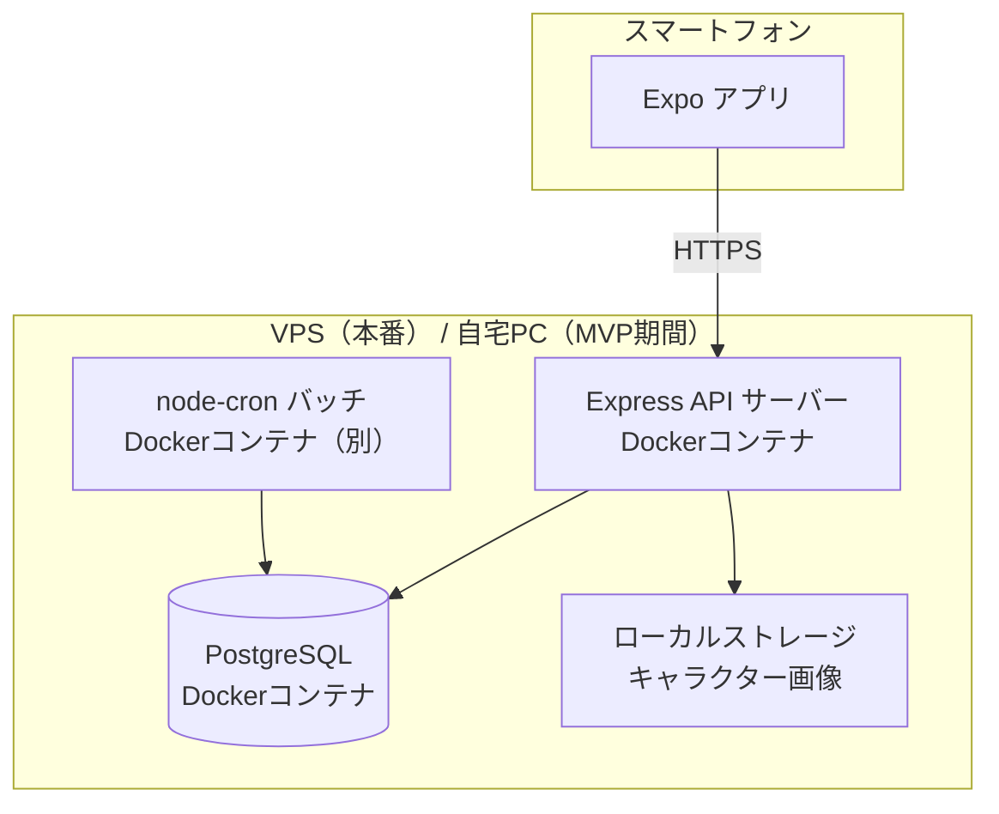
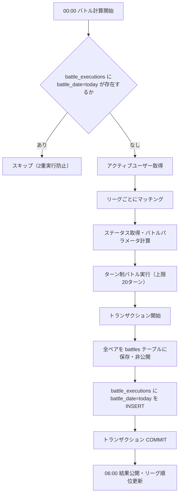
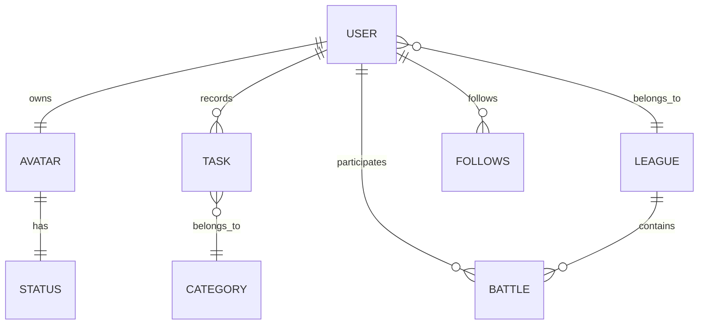

# タスク成長型SNS PvPアプリ 仕様書（MVP）

**バージョン:** 3.0.0　　**作成日:** 2026年3月

## 更新履歴

| バージョン | 内容 |
|---|---|
| v3.0.0 | Issue #2〜#6 反映（タスクカテゴリ4分類化・ステータス体系刷新・職業システム再設計・ターン制バトル導入・バランスシミュレーション仕様追加） |
| v2.5.0 | 技術スタック改善反映（開発環境をDocker統一・バッチを別コンテナに分離・本番インフラをVPS移行方針に変更） |
| v2.4.0 | レビュー指摘反映（in_progress タスクのバトル計算除外を明記・DELETE /v1/tasks/:id の仕様追加・リフレッシュトークンローテーション方針を注記・GET /v1/tasks の date パラメータ JST 基準を明記・少人数リーグの昇格0人問題を注記） |
| v2.3.0 | レビュー指摘反映（バトルフロー順序修正・battle_executions トランザクション明記・タスク終了の403定義・タイムゾーン明記・in_progress タスク扱い明記・勝率ゼロ除算対策・タイムサークル日付定義・battled_at 定義・タイムライン category 追加・GET /v1/league レスポンス修正） |
| v2.2.1 | バッチ冪等性の設計を修正（battle_executions テーブルに分離・battles テーブルの誤ったUNIQUE INDEX・processed カラムを削除） |
| v2.2.0 | 放置EXP上限追加・バッチ冪等性・トランザクション方針・インデックス定義・トークンハッシュ化・エラーコード細分化 |
| v2.1.0 | end_time をサーバー記録方式に変更・フォロー機能をMVPに追加 |
| v2.0.0 | 設計書 v1.3.0 との整合性を全面的に反映（エンドポイント・フロー・エラーハンドリング等） |
| v1.0.0 | 初版作成 |

---

## 1. 概要

本アプリは、日々のタスク実行をゲーム化し、キャラクター育成・SNS共有・リーグ対戦を通じてユーザーの継続的な行動を促進するサービスである。

ユーザーはタスクを記録することでキャラクターのステータスを成長させる。タスクはSNS投稿として共有でき、1日の時間の使い方は **24時間の円グラフ（タイムサークル）** として可視化される。

毎日定時にキャラクター同士の自動ターン制バトルが行われ、リーグランキングが更新される。

---

## 2. サービス構造



---

## 3. 技術スタック

| レイヤー | 技術 | 備考 |
|---|---|---|
| フロントエンド | Expo (React Native) | iOS / Android |
| バックエンド | Node.js + Express | REST API・Docker コンテナ |
| データベース | PostgreSQL 16 | Docker コンテナ |
| バッチ処理 | node-cron | デイリーバトル・APIとは別コンテナで動作 |
| 認証 | JWT (Bearer Token) | アクセス1h / リフレッシュ30d |
| インフラ（本番） | VPS | Docker Compose・本番運用時に移行 |
| 開発環境 | Docker Compose（全コンテナ統一） | ボリュームマウント + nodemon で自動再起動 |

---

## 4. システム構成

### 4.1 開発環境

| コンポーネント | 場所 | 起動方法 |
|---|---|---|
| PostgreSQL | Docker コンテナ | `docker compose up` |
| Express API | Docker コンテナ（ボリュームマウント） | `docker compose up` |
| バッチ処理 | Docker コンテナ（API とは別） | `docker compose up` |
| Expo | ローカル (各自の PC) | `expo start` |

> **開発環境の統一：** API・バッチ・DB をすべて Docker Compose で管理する。`apps/api` ディレクトリをコンテナ内にボリュームマウントすることで、ローカルでファイルを編集すると nodemon が自動検知してサーバーを再起動する。Node.js のローカルインストールは不要。

```yaml
# docker-compose.yml（開発環境）の構成例
services:
  api:
    build: ./apps/api
    volumes:
      - ./apps/api:/app
    command: npx nodemon src/index.js
    depends_on:
      - db
  batch:
    build: ./apps/api
    volumes:
      - ./apps/api:/app
    command: node src/batch/dailyBattle.js
    depends_on:
      - db
  db:
    image: postgres:16
```

### 4.2 本番環境

| コンポーネント | 場所 | 起動方法 |
|---|---|---|
| PostgreSQL | Docker コンテナ (VPS) | `docker compose up` |
| Express API | Docker コンテナ (VPS) | `docker compose up` |
| バッチ処理 | Docker コンテナ (VPS・API とは別) | `docker compose up` |
| Expo | ユーザーのスマートフォン | Expo Go / スタンドアロンビルド |

> **本番インフラの方針：** MVP期間中は自宅PC + Cloudflare Tunnel での稼働を許容する。ユーザー公開・本番運用のタイミングで VPS（Railway・Fly.io・さくらVPS 等）に移行する。docker-compose.yml の構成はそのまま流用できるため、移行時のコード変更は不要。VPS に移行することで自宅PCのスリープ・シャットダウンによるバッチ停止問題が解消される。

### 4.3 構成図



---

## 5. ユーザー機能

### 5.1 アカウント作成

- ユーザーはアカウントを作成してサービスを利用する。
- 初回ログイン時にキャラクターを作成する。

### 5.2 キャラクター作成（職業選択）

ユーザーは職業を選択する。職業によって「親カテゴリ × ステータス」の成長補正倍率が変化する。見た目は画像差し替えで表現する。

| 職業 | 概要 | 得意カテゴリ | 苦手カテゴリ |
|---|---|---|---|
| まほうつかい | 知識と感性で戦う。かしこさ・すばやさが伸びやすい | 勉強・芸術 | 運動 |
| せんし | 肉体を鍛え力で圧倒する。ちから・たいりょくが伸びやすい | 運動 | 勉強・芸術 |
| そうりょ | バランス型。まもり・たいりょくが安定して伸びる。全カテゴリ均等で「その他」がやや得意 | その他 | 特になし |

---

## 6. タスクシステム

タスクはタイマー方式で記録する。開始・終了を別々に送信する2段階設計とする。

| タイミング | 送信項目 | 説明 |
|---|---|---|
| タイマー開始時 | `task_name`、`category`、`visibility` | タスク名・カテゴリ・公開設定を送信。`start_time` はサーバーが記録 |
| タイマー終了時 | なし | リクエストを送るだけ。`end_time` はサーバーが `now()` で記録。`duration_minutes` はサーバーが自動計算 |

### 6.1 タスクカテゴリ

タスクには親カテゴリを付与する。カテゴリによってEXPのステータス分配比率が変化する。合計は常に100%。

| カテゴリ | 例 | ちから | まもり | かしこさ | すばやさ | たいりょく |
|---|---|---|---|---|---|---|
| 勉強 | 読書・語学・資格・プログラミング | 5% | 10% | 50% | 20% | 15% |
| 運動 | ランニング・筋トレ・スポーツ | 35% | 10% | 5% | 10% | 40% |
| 芸術 | 絵・音楽・執筆・創作全般 | 10% | 10% | 20% | 45% | 15% |
| その他 | 上記に当てはまらないもの | 10% | 40% | 15% | 10% | 25% |

**MVP：** ユーザーがタスク作成時にカテゴリを手動で選択する。

**v1.1以降：** ユーザーが自由入力したタスク名に対して、AIがカテゴリを自動判定する（OpenAI API等）。分類結果はユーザーが確認・手動修正できるようにする。

### 6.2 タスク公開設定（SNS機能）

タスクはSNS投稿として共有できる。タイムラインには公開タスクが表示される。

| 設定 | 説明 |
|---|---|
| `public` | 全ユーザーに公開 |
| `followers` | フォロワーのみ |
| `private` | 自分のみ |

### 6.3 タイムサークル（1日円グラフ）

ユーザーの1日を24時間の円グラフで可視化する。

- 24時間 = 360° として扱う。
- タスク完了時に該当時間の部分が円グラフに追加される。
- **日付の定義：** タスクの所属日は `start_time`（JST）の日付で決定する。深夜をまたぐタスク（例：23:00〜01:00）は開始日に属し、翌日には表示されない。`GET /v1/timecircle?date=YYYY-MM-DD` の `date` パラメータも JST 基準とする。

複数タブでのタイマー重複起動を防ぐため、以下の二重防衛を行う。

- **フロントエンド：** タイマー起動時に `localStorage` でアクティブタイマーの存在を確認し、既に起動中の場合は新たなタイマー起動をブロックしてユーザーに通知する。
- **バックエンド：** タスク保存時にDBで「同一ユーザーの未終了タスク（`end_time IS NULL`）」が存在する場合は `409 TASK_ALREADY_RUNNING` を返す。フロント側の制御をすり抜けた場合の最終防衛ラインとして機能させる。

---

## 7. EXP・ステータス計算仕様

### 7.1 EXP計算

```
effective_minutes = min(duration_minutes, 180)
exp = effective_minutes × 10
```

**例：** 60分 → 600 EXP　／　300分（放置）→ 180分扱いで 1800 EXP

> **上限設定の意図：** 放置によるEXP水増しを防ぐため、1タスクあたりの有効時間を180分に制限する。タイムサークルへの表示は実際の `duration_minutes` を使用する（見た目には影響しない）。

### 7.2 ステータス

| ステータス | 意味 | 主な対応カテゴリ |
|---|---|---|
| ちから | 攻撃力・行動力 | 運動 |
| まもり | 防御力・耐久 | その他 |
| かしこさ | 知力・応用力 | 勉強 |
| すばやさ | 速度・反応力 | 芸術 |
| たいりょく | HP・スタミナ・持久力 | 運動（サブ） |

### 7.3 ステータス分配（カテゴリ別）

カテゴリによってEXPのステータス分配比率が変わる（セクション6.1参照）。

計算式：

```
ステータス増加量 = exp × カテゴリ分配比率 × 職業補正倍率[職業][カテゴリ]
```

### 7.4 職業補正マトリクス

補正は「職業 × 親カテゴリ」の組み合わせで決まる。

| 職業 | 勉強 | 運動 | 芸術 | その他 |
|---|---|---|---|---|
| まほうつかい | ×1.5 | ×0.7 | ×1.4 | ×0.9 |
| せんし | ×0.7 | ×1.6 | ×0.8 | ×1.1 |
| そうりょ | ×1.0 | ×1.0 | ×1.0 | ×1.3 |

> **バランス設計の意図：** まほうつかいは勉強・芸術に特化し運動が苦手。せんしは運動に特化し勉強・芸術が苦手。そうりょは全カテゴリ均等でその他のみ得意。数値の妥当性はバランスシミュレーション（§19 将来実装）で検証する。

### 7.5 レベル計算

```
level = floor( sqrt(total_exp / 100) )
```

序盤はレベルが上がりやすく、後半は緩やかに成長する。

---

## 8. バトルシステム

キャラクター同士の自動ターン制バトルを行う。ステータスがバトルパラメータに直結する。

### 8.1 ステータス → バトルパラメータ対応

| ステータス | バトルパラメータ | 計算式 |
|---|---|---|
| たいりょく | 最大HP | `たいりょく × 10 + 100` |
| ちから | 攻撃ダメージ基礎値 | `ちから × 1.5` |
| まもり | 防御値（ダメージ減算） | `まもり × 1.0` |
| かしこさ | クリティカル率 | `min(かしこさ / 500, 0.3)`（上限30%） |
| すばやさ | 先攻決定 | 高い方が先攻。同値はランダム |

### 8.2 ターン進行フロー

```
1. すばやさ比較 → 高い方が先攻決定（同値はランダム）
2. 先攻側が攻撃
   ダメージ = ちから × 1.5 - 相手のまもり × 1.0
   ※乱数 ±10% を加算
   ※最低ダメージ保証: max(ダメージ, 1)
   ※かしこさでクリティカル判定（成功時: ダメージ × 1.5・まもり無視）
3. 後攻側が攻撃（同様）
4. どちらかのHPが0以下になったら決着
5. 上限20ターンで決着しない場合は最終ターンでランダム決着
```

### 8.3 乱数設計

- 乱数ブレ幅は **±10%**
- シード値はDBに保存しない（MVPスコープ外・実装シンプルさを優先）
- バトルログ（ターン履歴）もMVPでは保存しない

### 8.4 MVPスコープ

| 機能 | MVP | v1.1以降 |
|---|---|---|
| 通常攻撃 | ✅ | - |
| クリティカル | ✅ | - |
| スキル・特殊行動 | ❌ | ✅ |
| バトルログ保存 | ❌ | ✅ |
| シード値記録 | ❌ | ✅ |

> **v1.1予定：** 直前タスクによるステータス急増がバトルに有利に働きすぎる問題については、過去3日平均ステータスの採用等で対処する予定。

---

## 9. リーグシステム

ユーザーはリーグに所属し、同じリーグのユーザー同士で対戦する。

| リーグ | 概要 |
|---|---|
| S | 最上位 |
| A | 上位 |
| B | 中位 |
| C | 下位 |

> **初期リーグ：** 新規ユーザーは全員最下位リーグ（Cリーグ）からスタートする。

### 9.1 昇格・降格ルール

- **昇格：** 勝率（`wins / match_count`）上位 `floor(リーグ人数 × 0.2)` 人を上位リーグへ（Sリーグは昇格なし）。同率の場合は最大HPを除いた総ステータス合計（`ちから + まもり + かしこさ + すばやさ + たいりょく`）で判断。
- **降格：** 勝率（`wins / match_count`）下位 `floor(リーグ人数 × 0.2)` 人を下位リーグへ（Cリーグは降格なし）。同率の場合は総ステータス合計で判断。
- **適用タイミング：** デイリーバトル終了直後（06:00 JST）。
- **ゼロ除算対策：** `match_count = 0` のユーザー（バイのみ等）は勝率を `0` として扱い、昇格対象には含めない。降格対象にも含めない（新規ユーザー保護）。

> **少人数リーグの昇格0人問題：** リーグ人数が4人以下の場合、`floor(人数 × 0.2) = 0` となり昇格者が出ない。MVPの初期フェーズでは意図的に許容する。ユーザーが増加した時点で自然に解消されるため、v1.1以降で最低昇格人数（例：1人）の設定を検討する。

### 9.2 ランキング

リーグ内の順位は以下の優先度で決定する。

1. 勝利数
2. 総ステータス合計（`ちから + まもり + かしこさ + すばやさ + たいりょく`）
3. ランダム（同率の場合）

---

## 10. デイリーバトル

毎日以下のスケジュールで自動バトルが行われる。

> **タイムゾーン基準：** バトルスケジュール（00:00・06:00）およびアクティブユーザー判定の「3日以内」はすべて **JST（UTC+9）** を基準とする。

> **in_progress タスクのバトル計算除外：** バトル計算時（00:00）に `end_time IS NULL` の進行中タスクが存在する場合、そのタスクのEXPはステータスに反映されていない。バトルは **`end_time IS NOT NULL` の完了済みタスクのみを集計したステータス**を使用する。深夜0時をまたいで作業中のユーザーは当日のバトルに反映されないため注意。

| 時刻 (JST) | ステップ | 処理 |
|---|---|---|
| 00:00 | 1 | アクティブユーザー（3日以内にタスクあり）を取得 |
| 00:00 | 2 | リーグごとにユーザーをリストアップ |
| 00:00 | 3 | リーグ内ユーザーが2人未満の場合はそのリーグのバトルをスキップ |
| 00:00 | 4 | リーグ内ユーザーをランダムにシャッフルしてペアを組む（奇数の場合は1人バイ） |
| 00:00 | 5 | 各ペアのバトルパラメータを計算（§8.1 の変換式を適用） |
| 00:00 | 6 | すばやさ比較で先攻決定。ターン制バトルを実行（上限20ターン） |
| 00:00 | 7 | 20ターン以内に決着しない場合は最終ターンでランダム決着 |
| 00:00 | 8 | **トランザクション内で** 全ペアを `battles` テーブルに `is_published = false` で保存し、同一トランザクション内で `battle_executions` に `battle_date = today` を INSERT（非公開） |
| 06:00 | 9 | `is_published = true` に更新 |
| 06:00 | 10 | `league_memberships` の `wins` / `losses` / `match_count` を更新 |
| 06:00 | 11 | 昇格処理（Sリーグは対象外） |
| 06:00 | 12 | 降格処理（Cリーグは対象外） |

### 10.1 マッチング詳細

| ケース | 挙動 |
|---|---|
| リーグ内が1人 | バトルスキップ（不戦勝なし） |
| リーグ内が2人以上 | ランダムシャッフル後にペアを組む |
| 奇数人数でペアが余る | 余った1人はバイ（その日のバトルなし・勝敗カウントなし・`match_count` も増えない） |
| 1ターンで同値ダメージ | 乱数±10%が加算されるため実質発生しない |
| 昇格・降格の基準 | 勝率（`wins / match_count`）で判断。バイの日は `match_count` に含まれないため勝率に影響しない |

### 10.2 バッチの冪等性

バッチ処理は冪等に設計する。`battles` テーブルは1日に複数レコードを持つため、冪等性の管理は専用の `battle_executions` テーブルで行う。処理前に `battle_date = today` のレコードが存在するか確認し、存在する場合はスキップすることで、PCスリープからの復旧後に再実行しても同一日付のバトルが2重実行されないことを保証する。



> **トランザクション保証：** `battles` テーブルへの全ペア保存と `battle_executions` への INSERT は同一トランザクション内で実行する。COMMIT前にクラッシュした場合はロールバックされ、復旧後の再実行で正常に処理される。

> **バッチ失敗時の挙動：** 自宅PCのスリープ等でバトルが実行されなかった場合、復旧後に即時実行する。ただし当日中（23:59まで）に復旧できなかった場合はその日のバトルをスキップする。

---

## 11. 放置ユーザー対策

一定期間タスクが実行されていないユーザーはリーグ対象から除外する。

- **非アクティブ判定：** 3日間タスクなし
- **復帰条件：** タスクを1件以上入力した時点で即時復帰。当日のバトルから参加する。

---

## 12. API設計

### 12.1 共通仕様

| 項目 | 内容 |
|---|---|
| ベースURL | `https://api.example.com` |
| APIバージョンプレフィックス | `/v1`（各エンドポイントに含む） |
| 形式 | REST / JSON |
| 認証 | `Authorization: Bearer {アクセストークン}` |
| 日時形式 | ISO 8601（例: `2025-04-01T09:00:00Z`） |

### 12.2 JWT トークン仕様

| トークン種別 | 有効期限 | 用途 |
|---|---|---|
| アクセストークン | 1時間 | APIリクエストへの添付 |
| リフレッシュトークン | 30日 | アクセストークンの再発行 |

アクセストークンが期限切れになった場合、リフレッシュトークンを使って自動的に新しいアクセストークンを取得する。ユーザーの再ログインは不要。

> **リフレッシュトークンのセキュリティ：** リフレッシュトークンは `bcrypt` でハッシュ化して `refresh_tokens` テーブルに保存する。検証時は受け取ったトークンと保存済みハッシュを `bcrypt.compare` で照合する。DBが漏洩しても生のトークンが復元できない。

> **リフレッシュトークンのローテーション（MVP省略・v1.1以降で対応）：** セキュリティのベストプラクティスとしては、リフレッシュトークンを使用するたびに古いトークンを失効させ新しいトークンを発行する「ローテーション」が推奨される。MVPでは実装コスト削減のため省略し、リフレッシュトークンは30日間の有効期限まで使い回す設計とする。

### 12.3 エンドポイント一覧

| メソッド | エンドポイント | 説明 | 認証 |
|---|---|---|---|
| POST | `/v1/auth/register` | ユーザー登録 | 不要 |
| POST | `/v1/auth/login` | ログイン・JWT発行 | 不要 |
| POST | `/v1/auth/refresh` | アクセストークン再発行 ※リフレッシュトークン必須 | 不要 |
| POST | `/v1/auth/logout` | ログアウト・リフレッシュトークン削除 | 必要 |
| POST | `/v1/avatar` | キャラクター作成 | 必要 |
| GET | `/v1/avatar` | 自分のキャラクター取得 | 必要 |
| GET | `/v1/avatar/:user_id` | 他ユーザーのキャラクター取得 | 必要 |
| POST | `/v1/tasks/start` | タイマー開始 | 必要 |
| PATCH | `/v1/tasks/:id/end` | タイマー終了・タスク完了 | 必要 |
| GET | `/v1/tasks` | 自分のタスク一覧 | 必要 |
| DELETE | `/v1/tasks/:id` | タスク削除 | 必要 |
| GET | `/v1/timecircle` | 今日のタイムサークル | 必要 |
| GET | `/v1/timecircle/:user_id` | 他ユーザーのタイムサークル | 必要 |
| GET | `/v1/timeline` | タイムライン取得 | 必要 |
| GET | `/v1/league` | リーグ・ランキング取得 | 必要 |
| GET | `/v1/battles` | 直近バトル結果 | 必要 |
| POST | `/v1/follows/:user_id` | フォローする | 必要 |
| DELETE | `/v1/follows/:user_id` | フォロー解除する | 必要 |
| GET | `/v1/follows/following` | 自分のフォロー一覧 | 必要 |
| GET | `/v1/follows/followers` | 自分のフォロワー一覧 | 必要 |

### 12.4 認証

**POST /v1/auth/register**

```json
// Request
{
  "username": "taro",
  "email": "taro@example.com",
  "password": "password123"
}

// Response 201
{
  "user_id": "uuid",
  "username": "taro",
  "access_token": "JWT",
  "refresh_token": "JWT"
}
```

**POST /v1/auth/login**

```json
// Request
{
  "email": "taro@example.com",
  "password": "password123"
}

// Response 200
{
  "access_token": "JWT",
  "refresh_token": "JWT",
  "user_id": "uuid"
}
```

**POST /v1/auth/refresh**

```json
// Request
{
  "refresh_token": "JWT"
}

// Response 200
{
  "access_token": "JWT"
}
```

### 12.5 キャラクター

**POST /v1/avatar**

```json
// Request
{
  "type": "mage" // "mage"（まほうつかい） | "warrior"（せんし） | "monk"（そうりょ）
}

// Response 201
{
  "avatar_id": "uuid",
  "type": "mage",
  "level": 1,
  "status": {
    "ちから": 0,
    "まもり": 0,
    "かしこさ": 0,
    "すばやさ": 0,
    "たいりょく": 0
  }
}
```

> アバターが既に存在する場合は `409 AVATAR_ALREADY_EXISTS` を返す。

**GET /v1/avatar**

```json
// Response 200
{
  "avatar_id": "uuid",
  "type": "mage",
  "level": 5,
  "total_exp": 2500,
  "status": {
    "ちから": 40,
    "まもり": 55,
    "かしこさ": 130,
    "すばやさ": 95,
    "たいりょく": 60
  }
}
```

### 12.6 タスク

**POST /v1/tasks/start**

```json
// Request
{
  "task_name": "数学勉強",
  "category": "勉強", // "勉強" | "運動" | "芸術" | "その他"
  "visibility": "public" // "public" | "followers" | "private"
}

// Response 201
{
  "task_id": "uuid",
  "task_name": "数学勉強",
  "start_time": "2025-04-01T09:00:00Z",
  "category": "勉強",
  "status": "in_progress"
}
```

> サーバー側で `end_time IS NULL` の未完了タスクが既に存在する場合は `409 TASK_ALREADY_RUNNING` を返す。

**PATCH /v1/tasks/:id/end**

```json
// Request Body: なし

// Response 200
{
  "task_id": "uuid",
  "task_name": "数学勉強",
  "category": "勉強",
  "start_time": "2025-04-01T09:00:00Z",
  "end_time": "2025-04-01T10:30:00Z",
  "duration_minutes": 90,
  "effective_minutes": 90,
  "exp_gained": 900,
  "status_gain": {
    "ちから": 45,
    "まもり": 90,
    "かしこさ": 450,
    "すばやさ": 180,
    "たいりょく": 135
  },
  "visibility": "public"
}
```

> `effective_minutes = min(duration_minutes, 180)`。放置等で180分を超えた場合、`exp_gained` は180分ベースで計算される。`duration_minutes` は実際の経過時間を返す（タイムサークル表示用）。
> 指定した `:id` のタスクが他ユーザーのものである場合は `403 FORBIDDEN` を返す。存在しないタスクIDの場合は `404 NOT_FOUND` を返す。

**GET /v1/tasks**

```json
// Query Params: ?date=2025-04-01
// ※ date パラメータは JST（UTC+9）基準。例: date=2025-04-01 は JST の 2025-04-01 00:00:00 〜 23:59:59 の範囲で start_time を持つタスクを返す。

// Response 200
{
  "tasks": [
    {
      "task_id": "uuid",
      "task_name": "数学勉強",
      "category": "勉強",
      "start_time": "2025-04-01T09:00:00Z",
      "end_time": "2025-04-01T10:30:00Z",
      "duration_minutes": 90,
      "effective_minutes": 90,
      "exp_gained": 900,
      "status": "completed",
      "visibility": "public"
    },
    {
      "task_id": "uuid",
      "task_name": "読書",
      "category": "勉強",
      "start_time": "2025-04-01T11:00:00Z",
      "end_time": null,
      "duration_minutes": null,
      "effective_minutes": null,
      "exp_gained": null,
      "status": "in_progress",
      "visibility": "private"
    }
  ]
}
```

> `status: "in_progress"` のタスク（`end_time IS NULL`）も一覧に含める。`end_time` / `duration_minutes` / `effective_minutes` / `exp_gained` は `null` で返す。

**DELETE /v1/tasks/:id**

```json
// Response 204: No Content
```

削除の制約は以下の通り。

| ケース | 挙動 |
|---|---|
| `in_progress` 状態のタスクを削除 | 削除可能。EXP・ステータスへの反映前のため、ステータスのロールバックは不要 |
| `completed` 状態のタスクを削除 | 削除可能。ただし**付与済みのEXP・ステータスはロールバックしない**（不可逆）。ユーザーは削除前にその旨を確認すること（フロントエンドで警告表示を推奨） |
| 他ユーザーのタスクを削除 | `403 FORBIDDEN` を返す |
| 存在しないタスクIDを指定 | `404 NOT_FOUND` を返す |

> **EXPがロールバックされない設計について：** `completed` タスクのEXP・ステータスを削除時にロールバックすると、削除のたびに `avatars` テーブルとのトランザクション管理が必要になり複雑度が増す。またゲームバランス上も「一度得たステータスは消えない」方が自然なため、不可逆とする。

### 12.7 タイムサークル

**GET /v1/timecircle**

```json
// Query Params: ?date=2025-04-01

// Response 200
{
  "date": "2025-04-01",
  "segments": [
    {
      "task_name": "数学勉強",
      "start_time": "09:00",
      "end_time": "10:30",
      "duration_minutes": 90
    }
  ],
  "total_recorded_minutes": 90
}
```

### 12.8 タイムライン（SNS）

**GET /v1/timeline**

```json
// Query Params: ?limit=20&offset=0

// Response 200
{
  "posts": [
    {
      "task_id": "uuid",
      "user_id": "uuid",
      "username": "taro",
      "task_name": "数学勉強",
      "category": "勉強",
      "duration_minutes": 90,
      "exp_gained": 900,
      "posted_at": "2025-04-01T10:30:00Z"
    }
  ]
}
```

タイムラインの表示条件は以下の通り。

| visibility | 表示条件 |
|---|---|
| `public` | 全ユーザーに表示 |
| `followers` | リクエストユーザーがその投稿者をフォローしている場合のみ表示 |
| `private` | 表示しない |

### 12.9 フォロー

**POST /v1/follows/:user_id**

```json
// Response 201
{
  "followee_id": "uuid",
  "followed_at": "2025-04-01T09:00:00Z"
}
```

> 自分自身をフォローした場合は `400 VALIDATION_ERROR`。すでにフォロー済みの場合は `409 FOLLOW_ALREADY_EXISTS` を返す。

**DELETE /v1/follows/:user_id**

```
// Response 204: No Content
```

**GET /v1/follows/following**

```json
// Response 200
{
  "following": [
    { "user_id": "uuid", "username": "hanako" }
  ]
}
```

**GET /v1/follows/followers**

```json
// Response 200
{
  "followers": [
    { "user_id": "uuid", "username": "jiro" }
  ]
}
```

### 12.10 リーグ・バトル

**GET /v1/league**

```json
// Response 200
{
  "league": "A",
  "rank": 3,
  "wins": 12,
  "losses": 4,
  "match_count": 16,
  "ranking": [
    {
      "rank": 1,
      "user_id": "uuid",
      "username": "hanako",
      "wins": 15,
      "losses": 1,
      "match_count": 16,
      "total_status": 520
    },
    {
      "rank": 2,
      "user_id": "uuid",
      "username": "jiro",
      "wins": 13,
      "losses": 3,
      "match_count": 16,
      "total_status": 495
    }
  ]
}
```

> `total_status` は `ちから + まもり + かしこさ + すばやさ + たいりょく` の合計値。旧仕様の `power`（base_power）から変更。

**GET /v1/battles**

```json
// Query Params: ?limit=10

// Response 200
{
  "battles": [
    {
      "battle_id": "uuid",
      "opponent_username": "hanako",
      "result": "win",
      "my_total_status": 380,
      "opponent_total_status": 310,
      "battled_at": "2025-04-02T06:00:00Z"
    }
  ]
}
```

> `battled_at` はバトル結果が公開された時刻（06:00 JST）を返す。バトル計算が実行された時刻（00:00）ではない。
> `my_total_status` / `opponent_total_status` はバトル時点の総ステータス合計値。旧仕様の `my_power` / `opponent_power` から変更。

---

## 13. エラーハンドリング方針

| HTTPステータス | code | 説明 |
|---|---|---|
| 400 | `VALIDATION_ERROR` | リクエストの形式不正・必須項目欠如 |
| 401 | `UNAUTHORIZED` | 認証失敗・トークン期限切れ・無効 |
| 403 | `FORBIDDEN` | アクセス権限なし |
| 404 | `NOT_FOUND` | リソースが存在しない |
| 409 | `TASK_ALREADY_RUNNING` | 進行中のタスクが既に存在する |
| 409 | `FOLLOW_ALREADY_EXISTS` | すでにフォロー済み |
| 409 | `AVATAR_ALREADY_EXISTS` | アバターが既に作成済み |
| 500 | `INTERNAL_ERROR` | サーバー内部エラー |

### 13.1 エラーレスポンス共通形式

```json
{ "error": { "code": "TASK_ALREADY_RUNNING", "message": "進行中のタスクがあります。先に終了してください" } }
```

### 13.2 フォロー操作のエラー

| ケース | HTTPステータス | code | メッセージ |
|---|---|---|---|
| 自分自身をフォロー | 400 | `VALIDATION_ERROR` | 自分自身はフォローできません |
| すでにフォロー済み | 409 | `FOLLOW_ALREADY_EXISTS` | すでにフォローしています |
| フォローしていないユーザーを解除 | 404 | `NOT_FOUND` | フォロー関係が存在しません |

### 13.3 方針

- 全ての controller は try-catch で囲み、500 エラーを必ずログ出力する
- クライアントには詳細なスタックトレースを返さない
- DB の一意制約違反 (`err.code === "23505"`) は 409 として返す。どの 409 サブコードを使うかは制約名で判別する
- JWT 検証失敗 (`JsonWebTokenError` / `TokenExpiredError`) は 401 として返す
- 409 のメッセージはユーザーが次に取るべき行動を明示する

---

## 14. データ構造（概念）



---

## 15. ファイル構成

### 15.1 バックエンド (`apps/api/src/`)

| ファイル | 役割 |
|---|---|
| `index.js` | サーバー起動・ルート登録 |
| `models/db.js` | PostgreSQL 接続プール管理 |
| `middleware/auth.js` | JWT 認証ミドルウェア |
| `routes/auth.js` | 認証エンドポイント定義 |
| `routes/avatar.js` | アバターエンドポイント定義 |
| `routes/tasks.js` | タスクエンドポイント定義 |
| `routes/timecircle.js` | タイムサークルエンドポイント定義 |
| `routes/timeline.js` | タイムラインエンドポイント定義 |
| `routes/league.js` | リーグ・バトルエンドポイント定義 |
| `routes/follows.js` | フォローエンドポイント定義 |
| `controllers/auth.js` | 認証ビジネスロジック |
| `controllers/avatar.js` | アバタービジネスロジック |
| `controllers/tasks.js` | タスクビジネスロジック |
| `controllers/timecircle.js` | タイムサークルビジネスロジック |
| `controllers/timeline.js` | タイムラインビジネスロジック |
| `controllers/league.js` | リーグ・バトルビジネスロジック |
| `controllers/follows.js` | フォロービジネスロジック |
| `batch/dailyBattle.js` | デイリーバトルバッチ処理 (node-cron) |

### 15.2 フロントエンド (`apps/mobile/`)

フロントエンド (Expo) のファイル構成は別途定義する。バックエンド API の実装完了後に作成予定。

---

## 16. ブランチ運用ルール

| ブランチ | 用途 | マージ先 |
|---|---|---|
| `main` | 本番相当・直接 push 禁止 | - |
| `develop` | 開発統合ブランチ | `main` |
| `feature/xxx` | 機能ごとの作業ブランチ | `develop` |
| `fix/xxx` | バグ修正ブランチ | `develop` |

- `develop` から `feature/xxx` ブランチを切る
- 実装・動作確認後に PR を出す
- レビューしてもらってから `develop` にマージ
- 直接 `main` / `develop` へ push しない

---

## 17. コーディング規約

### 17.1 命名規則

| 対象 | スタイル | 例 |
|---|---|---|
| 変数・関数 | camelCase | `taskName`, `getUserById` |
| 定数 | UPPER_SNAKE_CASE | `JWT_SECRET` |
| ファイル名 | camelCase | `auth.js`, `dailyBattle.js` |
| DB カラム | snake_case | `task_name`, `start_time` |
| 環境変数 | UPPER_SNAKE_CASE | `DATABASE_URL` |

### 17.2 コード規約

- インデントはスペース 2 つ
- 文字列はシングルクォート (`'`) を使う
- セミコロンは必ずつける
- async/await を使い Promise チェーンは使わない
- controller は必ず try-catch で囲む
- `console.log` はデバッグ用のみ。本番コードには残さない

### 17.3 コミットメッセージ規約

| プレフィックス | 用途 | 例 |
|---|---|---|
| `feat` | 新機能追加 | `feat: 認証 API 実装` |
| `fix` | バグ修正 | `fix: ログイン時のエラー修正` |
| `chore` | 設定・環境変更 | `chore: Docker 設定追加` |
| `docs` | ドキュメント更新 | `docs: 設計書追加` |
| `refactor` | リファクタリング | `refactor: controller 整理` |

---

## 18. MVP機能一覧

| 機能 | 説明 |
|---|---|
| ユーザー登録 | アカウント作成・ログイン |
| キャラクター作成 | 職業選択（まほうつかい／せんし／そうりょ）・初期ステータス設定 |
| タスク入力 | タスク名・カテゴリ・開始・終了時間の記録（2段階タイマー方式・end_timeはサーバー記録・有効時間上限180分） |
| タスクSNS投稿 | 公開設定付き投稿・タイムライン表示 |
| タスクカテゴリ選択 | タスク作成時に親カテゴリ（勉強／運動／芸術／その他）を手動選択・カテゴリ別EXP分配 |
| タイムサークル表示 | 1日の時間を円グラフで可視化 |
| ステータス成長 | EXP計算・職業補正込みのステータス更新（トランザクション保証） |
| 自動バトル | デイリーターン制バトルの実行・結果保存（00:00実行・06:00公開・冪等性保証） |
| リーグランキング | 勝率ベースの昇格・降格処理 |
| フォロー機能 | ユーザーのフォロー・フォロー解除・一覧取得 |

---

## 19. 将来実装

| 機能 | バージョン | 概要 |
|---|---|---|
| AIタスク自動分類 | v1.1 | タスク名から親カテゴリ（勉強・運動・芸術・その他）をAIが自動判定・手動修正可（OpenAI API等） |
| バトルバランスシミュレーション | v1.1 | 職業補正マトリクスの妥当性をモンテカルロシミュレーション（10,000試合以上）で検証。全職業組み合わせの勝率が 40%〜60% に収まることを確認し、結果を仕様書に付記する |
| バトル公平性改善 | v1.1 | 直前タスクによるステータス急増の影響を緩和（過去3日平均ステータス採用等を検討） |
| リフレッシュトークンローテーション | v1.1 | 使用のたびに旧トークンを失効させ新トークンを発行するローテーション方式に移行 |
| スキル・特殊行動 | v1.1 | バトルに職業固有スキルを追加 |
| バトルログ保存 | v1.1 | ターン履歴をDBに保存し、ユーザーがバトル詳細を閲覧できるようにする |
| 少人数リーグの最低昇格人数 | v1.1 | リーグ人数が少ない場合の昇格0人問題に対し、最低昇格人数（例：1人）を設定する |
| ファイルアップロードによる自動分類 | v2以降 | 勉強に使ったノート・PDFをアップロードし、学習内容を解析してカテゴリ判定・EXP自動付与 |
| 位置情報連携EXP | v2以降 | ランニング等で移動した距離をGPSで取得し、距離に応じてちからのEXPを自動付与 |
| タイムラインのスケーラビリティ改善 | v2以降 | ユーザー増加に備えたfanoutアーキテクチャまたはキャッシュ層の導入 |
