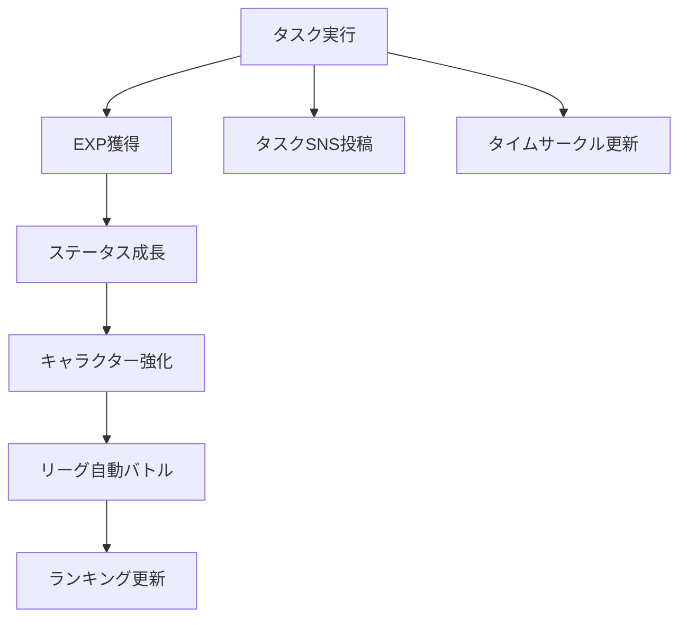
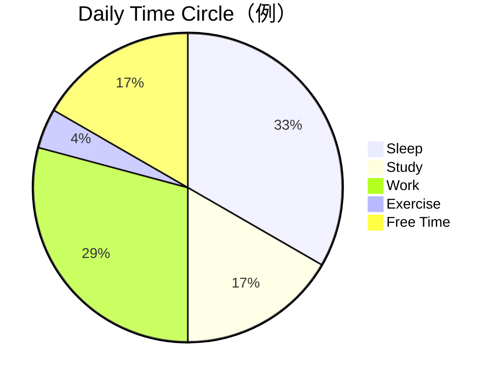
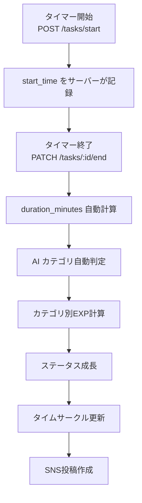
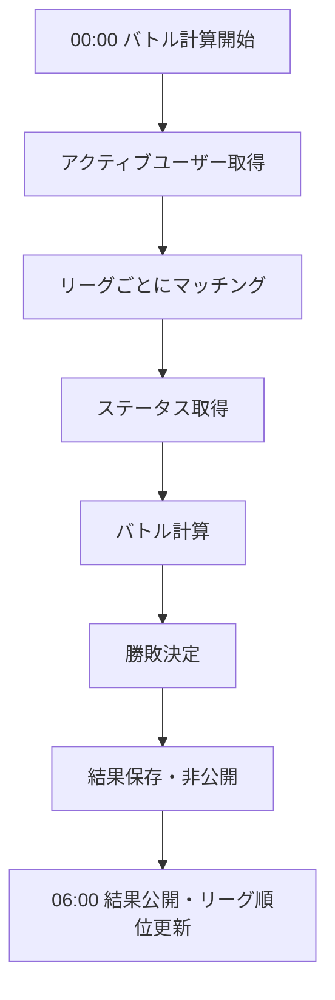
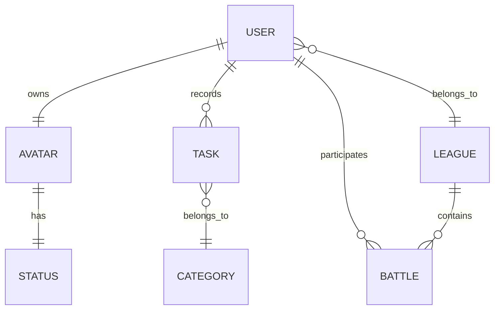
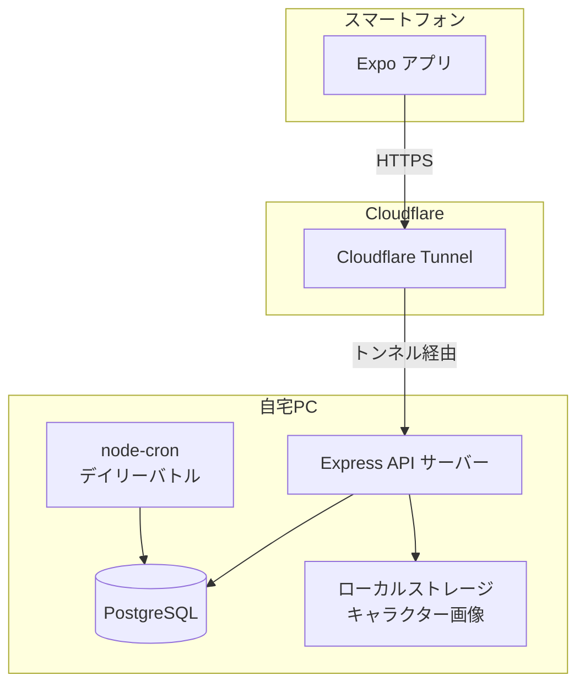

# タスク成長型SNS PvPアプリ 仕様書（MVP）

---

## 1. 概要

本アプリは、日々のタスク実行をゲーム化し、キャラクター育成・SNS共有・リーグ対戦を通じてユーザーの継続的な行動を促進するサービスである。

ユーザーはタスクを記録することでキャラクターのステータスを成長させる。タスクはSNS投稿として共有でき、1日の時間の使い方は **24時間の円グラフ（タイムサークル）** として可視化される。

毎日定時にキャラクター同士の自動バトルが行われ、リーグランキングが更新される。

---

## 2. サービス構造



---

## 3. ユーザー機能

### 3.1 アカウント作成

- ユーザーはアカウントを作成してサービスを利用する。
- 初回ログイン時にキャラクターを作成する。

### 3.2 キャラクター作成

ユーザーはキャラクタータイプを選択する。キャラクタータイプによってステータスの成長倍率が変化する。見た目は画像差し替えで表現する。

| タイプ | 概要 |
|--------|------|
| 研究者 | 知力・集中が伸びやすい |
| 戦士 | 体力が特化して伸びる |
| 修行僧 | 精神・集中がバランスよく伸びる |

---

## 4. タスクシステム

タスクはタイマー方式で記録する。開始・終了を別々に送信する2段階設計とする。

| タイミング | 送信項目 | 説明 |
|------------|----------|------|
| タイマー開始時 | `task_name`、`visibility` | タスク名と公開設定を送信。`start_time` はサーバーが記録 |
| タイマー終了時 | `end_time` | 終了時刻を送信。`duration_minutes` はサーバーが自動計算 |

**記録例**

| task_name | start_time（自動） | end_time | duration（自動計算） |
|-----------|-------------------|----------|----------------------|
| 数学勉強 | 09:00 | 10:30 | 90分 |

---

## 4.1 タスクカテゴリ

タスクにはカテゴリを付与する。カテゴリによってステータス分配の重みが変化する（将来実装）。

### 標準カテゴリ一覧とステータス分配比率

カテゴリによってEXPのステータス分配比率が変わる。合計は常に100%。

| カテゴリ | 例 | INT | STR | FOC | SPI |
|----------|----|-----|-----|-----|-----|
| 学習 | 勉強、読書、語学、資格 | 40% | 5% | 40% | 15% |
| 運動 | ランニング、筋トレ、スポーツ | 5% | 60% | 20% | 15% |
| 瞑想・休養 | 瞑想、睡眠、休憩 | 5% | 10% | 15% | 70% |
| 創作 | 絵、音楽、執筆、プログラミング | 35% | 5% | 45% | 15% |
| 家事・生活 | 料理、掃除、買い物 | 10% | 40% | 15% | 35% |
| 仕事 | 業務、会議、企画 | 35% | 10% | 45% | 10% |
| その他 | 上記に該当しないもの | 30% | 20% | 30% | 20% |

### タスクカテゴリの入力方法

**MVP：** ユーザーがタスク作成時にカテゴリを手動で選択する。

**v1.1以降：** ユーザーが自由入力したタスク名に対して、AIがカテゴリを自動判定する。

```
入力例：「英単語を100個覚えた」→ カテゴリ：学習（INT 40% / FOC 40% / SPI 15% / STR 5%）
入力例：「5km走った」         → カテゴリ：運動（STR 60% / FOC 20% / SPI 15% / INT 5%）
```

- 分類に使用するモデルは軽量なテキスト分類APIを想定（例：OpenAI API）。
- 分類結果はユーザーが確認・手動修正できるようにする。

### 将来実装

| 機能 | バージョン | 概要 |
|------|------------|------|
| AIタスク自動分類 | v1.1 | タスク名からカテゴリをAIが自動判定・手動修正可（OpenAI API等） |
| ファイルアップロードによる自動分類 | v2以降 | 勉強に使ったノート・PDFをアップロードし、学習内容を解析してカテゴリ判定・EXP自動付与 |
| 位置情報連携EXP | v2以降 | ランニング等で移動した距離をGPSで取得し、距離に応じてSTRのEXPを自動付与 |

---

## 5. タスク公開設定（SNS機能）

タスクはSNS投稿として共有できる。タイムラインには公開タスクが表示される。

| 設定 | 説明 |
|------|------|
| `public` | 全ユーザーに公開 |
| `followers` | フォロワーのみ |
| `private` | 自分のみ |

---

## 6. EXP計算

EXPは作業時間に比例する。

```
exp = duration_minutes × 10
```

**例：** 60分 → 600 EXP

> **EXP上限：** MVPでは上限を設けない。頑張った分だけ成長できる設計とする。ただし時間の水増し記録やユーザー間の不公平が顕在化した場合はv1.1で1日あたりの上限導入を検討する。

---

## 7. ステータス

キャラクターには以下の4つのステータスが存在する。

| ステータス | 意味 |
|------------|------|
| INT | 知力 |
| STR | 体力 |
| FOC | 集中 |
| SPI | 精神 |

---

## 8. ステータス成長

EXPは以下の割合で各ステータスに分配される（合計100%）。

| ステータス | 割合 | 計算式 |
|------------|------|--------|
| INT | 30% | `int_gain = exp × 0.3` |
| STR | 20% | `str_gain = exp × 0.2` |
| FOC | 30% | `foc_gain = exp × 0.3` |
| SPI | 20% | `spi_gain = exp × 0.2` |

---

## 9. キャラクタータイプ補正

キャラクタータイプによってステータス成長倍率が変化する。

| ステータス | 研究者 | 戦士 | 修行僧 |
|------------|--------|------|--------|
| INT | ×1.4 | ×0.8 | ×1.0 |
| STR | ×0.8 | ×1.5 | ×0.9 |
| FOC | ×1.2 | ×1.0 | ×1.2 |
| SPI | ×1.0 | ×1.1 | **×1.3** |
| **合計** | **4.4** | **4.4** | **4.4** |


---

## 10. レベルシステム

レベルは累積EXPによって決まる。

```
level = floor( sqrt(total_exp / 100) )
```

- 序盤はレベルが上がりやすく、後半は緩やかに成長する。

---

## 11. タイムサークル（1日円グラフ）

ユーザーの1日を24時間の円グラフで可視化する。

- 24時間 = 360° として扱う。
- タスク完了時に該当時間の部分が円グラフに追加される。
- 1日の終わりには、ユーザーの時間の使い方が視覚的に完成する。



> **仕様：** タスクはタイマー開始と同時に記録が始まるため、通常は時間帯の重複は発生しない。ただし複数タブで同時にタイマーを起動した場合に重複が生じうるため、以下の対処を行う。
>
> - **フロントエンド：** タイマー起動時に `localStorage` でアクティブタイマーの存在を確認し、既に起動中の場合は新たなタイマー起動をブロックしてユーザーに通知する。
> - **バックエンド：** タスク保存時にDBで「同一ユーザーの未終了タスク（`end_time IS NULL`）」が存在する場合は `409 CONFLICT` を返す。フロント側の制御をすり抜けた場合の最終防衛ラインとして機能させる。

---

## 12. タスク処理フロー



---

## 13. バトルシステム

キャラクター同士の自動バトルを行う。戦闘力はステータスから計算する。

```
base_power = INT × 1.1 + STR × 1.0 + FOC × 1.2 + SPI × 1.0
random_range = floor(base_power × 0.1)
power = base_power + random(0〜random_range)
```

`power` が高い方が勝利する。ランダム幅は戦闘力の10%とすることで、序盤は小さく・後半は適度なブレが生まれ、実力差を正直に反映しつつ番狂わせも起きる設計とする。

---

## 14. リーグシステム

ユーザーはリーグに所属し、同じリーグのユーザー同士で対戦する。

| リーグ | 概要 |
|--------|------|
| S | 最上位 |
| A | 上位 |
| B | 中位 |
| C | 下位 |

> **仕様：** 各リーグの上位20%が翌日昇格、下位20%が降格。適用タイミングはデイリーバトル終了直後。
>
> **初期リーグ：** 新規ユーザーは全員最下位リーグ（Cリーグ）からスタートする。

---

## 15. デイリーバトル

毎日以下のスケジュールで自動バトルが行われる。

| 時刻 | 処理 |
|------|------|
| 00:00 | バトル計算実行（その時点のステータスを使用） |
| 06:00 | バトル結果・リーグ順位をユーザーに公開 |



> **バッチ失敗時の挙動：** 自宅PCのスリープ等でバトルが実行されなかった場合、復旧後に即時実行する。ただし当日中（23:59まで）に復旧できなかった場合はその日のバトルをスキップする。

---

## 16. ランキング

リーグ内の順位は以下の優先度で決定する。

1. 勝利数
2. 総戦闘力
3. ランダム（同率の場合）

---

## 17. 放置ユーザー対策

一定期間タスクが実行されていないユーザーはリーグ対象から除外する。

- **非アクティブ判定：** 3日間タスクなし
- **復帰条件：** タスクを1件以上入力した時点で即時復帰。当日のバトルから参加する。

---

## 18. データ構造（概念）



---

## 19. MVP機能一覧

初期リリースでは以下の機能を実装する。

| 機能 | 説明 |
|------|------|
| ユーザー登録 | アカウント作成・ログイン |
| キャラクター作成 | タイプ選択・初期ステータス設定 |
| タスク入力 | タスク名・開始・終了時間の記録 |
| タスクSNS投稿 | 公開設定付き投稿・タイムライン表示 |
| タスクカテゴリ選択 | タスク作成時にカテゴリを手動選択・カテゴリ別EXP分配 |
| タイムサークル表示 | 1日の時間を円グラフで可視化 |
| ステータス成長 | EXP計算・タイプ補正込みのステータス更新 |
| 自動バトル | デイリーバトルの実行・結果保存 |
| リーグランキング | 勝利数ベースの順位更新 |

> **実装優先度の提案：** SNSのフォロー・タイムライン機能とバトル・ランキング機能を同時にMVPに含めると開発コストが高い。どちらかをv1.1に後回しにすることを検討してもよい。

---

## 20. システム構成図

### 採用技術スタック

| レイヤー | 技術 | 備考 |
|----------|------|------|
| フロントエンド | Expo（React Native） | iOS / Android アプリ |
| バックエンド | Node.js + Express | |
| データベース | PostgreSQL | 自宅PC上で稼働 |
| バッチ処理 | node-cron | デイリーバトル用 |
| インフラ | 自宅PC + Cloudflare Tunnel | 外部公開はTunnelで対応 |
| 認証 | JWT（Bearer Token） | |

### 構成図



### 各コンポーネントの役割

| コンポーネント | 役割 |
|----------------|------|
| Expo | モバイル画面の描画・APIリクエスト送信 |
| Express API | ビジネスロジック・DB操作・認証処理 |
| PostgreSQL | ユーザー・タスク・バトル等の永続データ管理 |
| ローカルストレージ | キャラクター画像の格納（自宅PC上） |
| node-cron | 毎日定時にデイリーバトルを実行するバッチ処理 |
| Cloudflare Tunnel | 自宅PCを外部公開するためのトンネル。固定IPなしでHTTPS通信が可能 |

> **Cloudflare Tunnel の注意点：** 自宅PCのシャットダウン・スリープ中はAPIが停止する。MVPでは許容範囲だが、本番運用時はサーバーの常時稼働を担保する仕組みが必要。

---

## 21. API設計

### 共通仕様

| 項目 | 内容 |
|------|------|
| ベースURL | `https://api.example.com/v1` |
| 形式 | REST / JSON |
| 認証 | `Authorization: Bearer {アクセストークン}` |
| 日時形式 | ISO 8601（例：`2025-04-01T09:00:00Z`） |

### 認証

#### JWTトークン仕様

| トークン種別 | 有効期限 | 用途 |
|--------------|----------|------|
| アクセストークン | 1時間 | APIリクエストへの添付 |
| リフレッシュトークン | 30日 | アクセストークンの再発行 |

アクセストークンが期限切れになった場合、リフレッシュトークンを使って自動的に新しいアクセストークンを取得する。ユーザーの再ログインは不要。

| メソッド | エンドポイント | 説明 |
|----------|----------------|------|
| POST | `/auth/register` | ユーザー登録 |
| POST | `/auth/login` | ログイン・JWT発行 |
| POST | `/auth/refresh` | アクセストークン再発行 |

**POST /auth/register**

```json
// Request
{
  "username": "taro",
  "email": "taro@example.com",
  "password": "password123"
}

// Response 201
{
  "user_id": "uuid",
  "username": "taro",
  "access_token": "JWT",
  "refresh_token": "JWT"
}
```

**POST /auth/login**

```json
// Request
{
  "email": "taro@example.com",
  "password": "password123"
}

// Response 200
{
  "access_token": "JWT",
  "refresh_token": "JWT",
  "user_id": "uuid"
}
```

**POST /auth/refresh**

```json
// Request
{
  "refresh_token": "JWT"
}

// Response 200
{
  "access_token": "JWT"
}
```

---

### キャラクター

| メソッド | エンドポイント | 説明 | 認証 |
|----------|----------------|------|------|
| POST | `/avatar` | キャラクター作成 | 必要 |
| GET | `/avatar` | 自分のキャラクター取得 | 必要 |
| GET | `/avatar/{user_id}` | 他ユーザーのキャラクター取得 | 不要 |

**POST /avatar**

```json
// Request
{
  "type": "researcher" // "researcher" | "warrior" | "monk"
}

// Response 201
{
  "avatar_id": "uuid",
  "type": "researcher",
  "level": 1,
  "status": {
    "INT": 0,
    "STR": 0,
    "FOC": 0,
    "SPI": 0
  }
}
```

**GET /avatar**

```json
// Response 200
{
  "avatar_id": "uuid",
  "type": "researcher",
  "level": 5,
  "total_exp": 2500,
  "status": {
    "INT": 105,
    "STR": 40,
    "FOC": 90,
    "SPI": 30
  }
}
```

---

### タスク

タスクはタイマー開始・終了を別々のAPIで送信する2段階設計とする。これにより「タイマー起動中」の状態をサーバーが把握でき、複数タブ重複防止の `end_time IS NULL` チェックが機能する。

| メソッド | エンドポイント | 説明 | 認証 |
|----------|----------------|------|------|
| POST | `/tasks/start` | タイマー開始・タスク作成 | 必要 |
| PATCH | `/tasks/{task_id}/end` | タイマー終了・タスク完了 | 必要 |
| GET | `/tasks` | 自分のタスク一覧取得 | 必要 |
| GET | `/tasks/{task_id}` | タスク詳細取得 | 必要 |
| DELETE | `/tasks/{task_id}` | タスク削除 | 必要 |

**POST /tasks/start**

```json
// Request
{
  "task_name": "数学勉強",
  "category": "学習", // "学習"|"運動"|"瞑想・休養"|"創作"|"家事・生活"|"仕事"|"その他"
  "visibility": "public" // "public" | "followers" | "private"
}

// Response 201
{
  "task_id": "uuid",
  "task_name": "数学勉強",
  "start_time": "2025-04-01T09:00:00Z",
  "category": "学習",
  "status": "in_progress"
}
```

> サーバー側で `end_time IS NULL` の未完了タスクが既に存在する場合は `409 CONFLICT` を返す。

**PATCH /tasks/{task_id}/end**

```json
// Request
{
  "end_time": "2025-04-01T10:30:00Z"
}

// Response 200
{
  "task_id": "uuid",
  "task_name": "数学勉強",
  "category": "学習",
  "start_time": "2025-04-01T09:00:00Z",
  "end_time": "2025-04-01T10:30:00Z",
  "duration_minutes": 90,
  "exp_gained": 900,
  "status_gain": {
    "INT": 360,
    "STR": 45,
    "FOC": 360,
    "SPI": 135
  },
  "visibility": "public"
}
```

**GET /tasks**

```json
// Query Params: ?date=2025-04-01

// Response 200
{
  "tasks": [
    {
      "task_id": "uuid",
      "task_name": "数学勉強",
      "category": "学習",
      "start_time": "2025-04-01T09:00:00Z",
      "end_time": "2025-04-01T10:30:00Z",
      "duration_minutes": 90,
      "exp_gained": 900,
      "status": "completed",
      "visibility": "public"
    }
  ]
}
```

---

### タイムサークル

| メソッド | エンドポイント | 説明 | 認証 |
|----------|----------------|------|------|
| GET | `/timecircle` | 今日のタイムサークル取得 | 必要 |
| GET | `/timecircle/{user_id}` | 他ユーザーのタイムサークル取得 | 不要 |

**GET /timecircle**

```json
// Query Params: ?date=2025-04-01

// Response 200
{
  "date": "2025-04-01",
  "segments": [
    {
      "task_name": "数学勉強",
      "start_time": "09:00",
      "end_time": "10:30",
      "duration_minutes": 90
    }
  ],
  "total_recorded_minutes": 90
}
```

---

### タイムライン（SNS）

| メソッド | エンドポイント | 説明 | 認証 |
|----------|----------------|------|------|
| GET | `/timeline` | タイムライン取得（公開タスク一覧） | 必要 |

**GET /timeline**

```json
// Query Params: ?limit=20&offset=0

// Response 200
{
  "posts": [
    {
      "task_id": "uuid",
      "user_id": "uuid",
      "username": "taro",
      "task_name": "数学勉強",
      "duration_minutes": 90,
      "exp_gained": 900,
      "posted_at": "2025-04-01T10:30:00Z"
    }
  ]
}
```

---

### リーグ・バトル

| メソッド | エンドポイント | 説明 | 認証 |
|----------|----------------|------|------|
| GET | `/league` | 自分のリーグとランキング取得 | 必要 |
| GET | `/battles` | 自分の直近バトル結果取得 | 必要 |

**GET /league**

```json
// Response 200
{
  "league": "A",
  "rank": 3,
  "wins": 12,
  "losses": 4,
  "ranking": [
    {
      "rank": 1,
      "user_id": "uuid",
      "username": "hanako",
      "wins": 15,
      "power": 320
    },
    {
      "rank": 2,
      "user_id": "uuid",
      "username": "jiro",
      "wins": 13,
      "power": 295
    }
  ]
}
```

**GET /battles**

```json
// Query Params: ?limit=10

// Response 200
{
  "battles": [
    {
      "battle_id": "uuid",
      "opponent_username": "hanako",
      "result": "win",  // "win" | "lose"
      "my_power": 310,
      "opponent_power": 295,
      "battled_at": "2025-04-02T00:00:00Z"
    }
  ]
}
```

---

### エラーレスポンス共通形式

```json
{
  "error": {
    "code": "UNAUTHORIZED",
    "message": "認証トークンが無効です"
  }
}
```

| HTTPステータス | codeの例 | 説明 |
|----------------|----------|------|
| 400 | `VALIDATION_ERROR` | リクエストの形式不正 |
| 401 | `UNAUTHORIZED` | 認証失敗・トークン期限切れ |
| 403 | `FORBIDDEN` | アクセス権限なし |
| 404 | `NOT_FOUND` | リソースが存在しない |
| 409 | `CONFLICT` | 重複登録（例：アバターが既に存在する） |
| 500 | `INTERNAL_ERROR` | サーバー内部エラー |
