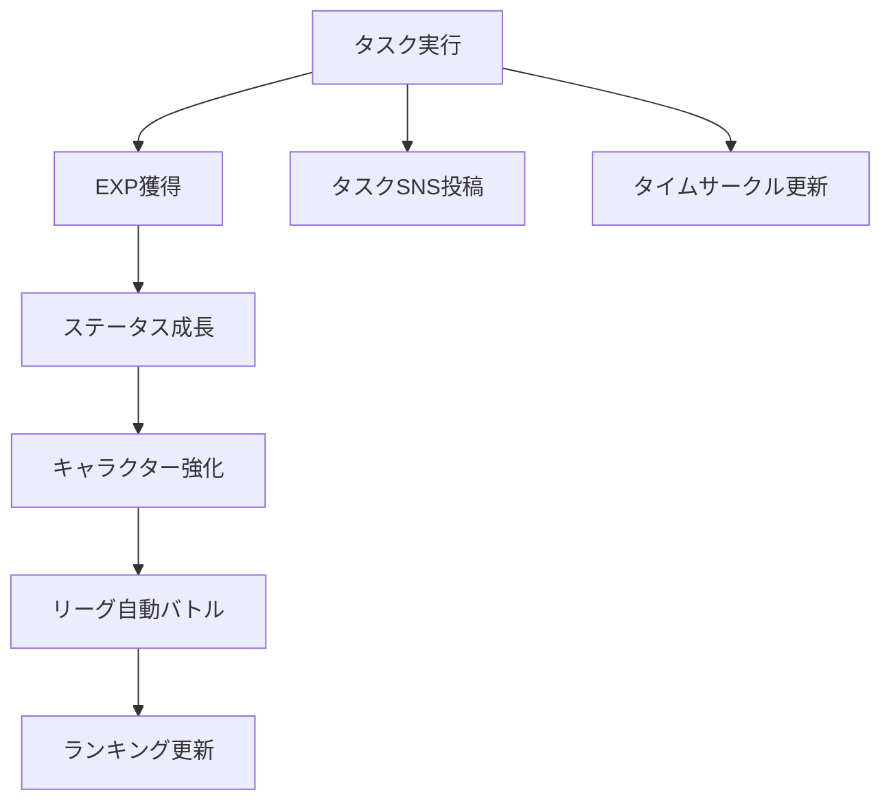
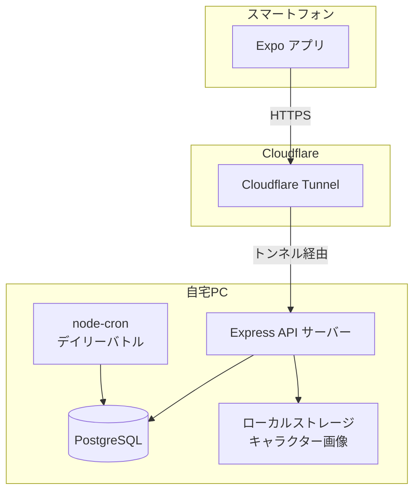
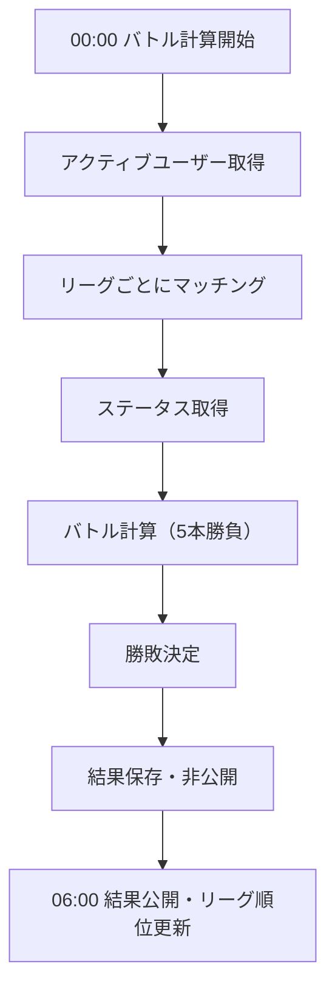
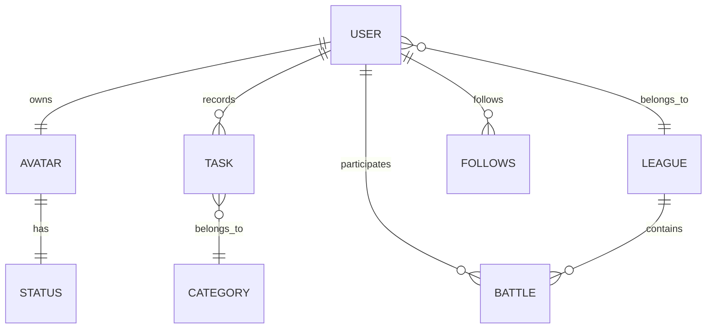

# タスク成長型SNS PvPアプリ 仕様書（MVP）

**バージョン:** 2.1.0　　**作成日:** 2026年3月

## 更新履歴

| バージョン | 内容 |
|---|---|
| v2.1.0 | end_time をサーバー記録方式に変更・フォロー機能をMVPに追加 |
| v2.0.0 | 設計書 v1.3.0 との整合性を全面的に反映（エンドポイント・フロー・エラーハンドリング等） |
| v1.0.0 | 初版作成 |

---

## 1. 概要

本アプリは、日々のタスク実行をゲーム化し、キャラクター育成・SNS共有・リーグ対戦を通じてユーザーの継続的な行動を促進するサービスである。

ユーザーはタスクを記録することでキャラクターのステータスを成長させる。タスクはSNS投稿として共有でき、1日の時間の使い方は **24時間の円グラフ（タイムサークル）** として可視化される。

毎日定時にキャラクター同士の自動バトルが行われ、リーグランキングが更新される。

---

## 2. サービス構造



---

## 3. 技術スタック

| レイヤー | 技術 | 備考 |
|---|---|---|
| フロントエンド | Expo (React Native) | iOS / Android |
| バックエンド | Node.js + Express | REST API |
| データベース | PostgreSQL 16 | Docker コンテナ |
| バッチ処理 | node-cron | デイリーバトル |
| 認証 | JWT (Bearer Token) | アクセス1h / リフレッシュ30d |
| インフラ（本番） | 自宅PC + Cloudflare Tunnel | Docker Compose |
| 開発環境 | Docker (DB のみ) + ローカル API | nodemon で自動再起動 |

---

## 4. システム構成

### 4.1 開発環境

| コンポーネント | 場所 | 起動方法 |
|---|---|---|
| PostgreSQL | Docker コンテナ | `docker compose up db -d` |
| Express API | ローカル (WSL2) | `npm run dev` |
| Expo | ローカル (各自の PC) | `expo start` |

### 4.2 本番環境

| コンポーネント | 場所 | 起動方法 |
|---|---|---|
| PostgreSQL | Docker コンテナ (自宅PC) | `docker compose up` |
| Express API | Docker コンテナ (自宅PC) | `docker compose up` |
| Cloudflare Tunnel | 自宅PC | `cloudflared tunnel run` |
| Expo | ユーザーのスマートフォン | Expo Go / スタンドアロンビルド |

> **Cloudflare Tunnel の注意点：** 自宅PCのシャットダウン・スリープ中はAPIが停止する。MVPでは許容範囲だが、本番運用時はサーバーの常時稼働を担保する仕組みが必要。

### 4.3 構成図



---

## 5. ユーザー機能

### 5.1 アカウント作成

- ユーザーはアカウントを作成してサービスを利用する。
- 初回ログイン時にキャラクターを作成する。

### 5.2 キャラクター作成

ユーザーはキャラクタータイプを選択する。キャラクタータイプによってステータスの成長倍率が変化する。見た目は画像差し替えで表現する。

| タイプ | 概要 |
|---|---|
| 研究者 | 知力・集中が伸びやすい |
| 戦士 | 体力が特化して伸びる |
| 修行僧 | 精神・集中がバランスよく伸びる |

---

## 6. タスクシステム

タスクはタイマー方式で記録する。開始・終了を別々に送信する2段階設計とする。

| タイミング | 送信項目 | 説明 |
|---|---|---|
| タイマー開始時 | `task_name`、`category`、`visibility` | タスク名・カテゴリ・公開設定を送信。`start_time` はサーバーが記録 |
| タイマー終了時 | なし | リクエストを送るだけ。`end_time` はサーバーが `now()` で記録。`duration_minutes` はサーバーが自動計算 |

### 6.1 タスクカテゴリ

タスクにはカテゴリを付与する。カテゴリによってEXPのステータス分配比率が変化する。合計は常に100%。

| カテゴリ | 例 | INT | STR | FOC | SPI |
|---|---|---|---|---|---|
| 学習 | 勉強、読書、語学、資格 | 40% | 5% | 40% | 15% |
| 運動 | ランニング、筋トレ、スポーツ | 5% | 60% | 20% | 15% |
| 瞑想・休養 | 瞑想、睡眠、休憩 | 5% | 10% | 15% | 70% |
| 創作 | 絵、音楽、執筆、プログラミング | 35% | 5% | 45% | 15% |
| 家事・生活 | 料理、掃除、買い物 | 10% | 40% | 15% | 35% |
| 仕事 | 業務、会議、企画 | 35% | 10% | 45% | 10% |
| その他 | 上記に該当しないもの | 30% | 20% | 30% | 20% |

**MVP：** ユーザーがタスク作成時にカテゴリを手動で選択する。

**v1.1以降：** ユーザーが自由入力したタスク名に対して、AIがカテゴリを自動判定する（OpenAI API等）。分類結果はユーザーが確認・手動修正できるようにする。

### 6.2 タスク公開設定（SNS機能）

タスクはSNS投稿として共有できる。タイムラインには公開タスクが表示される。

| 設定 | 説明 |
|---|---|
| `public` | 全ユーザーに公開 |
| `followers` | フォロワーのみ |
| `private` | 自分のみ |

### 6.3 タイムサークル（1日円グラフ）

ユーザーの1日を24時間の円グラフで可視化する。

- 24時間 = 360° として扱う。
- タスク完了時に該当時間の部分が円グラフに追加される。

複数タブでのタイマー重複起動を防ぐため、以下の二重防衛を行う。

- **フロントエンド：** タイマー起動時に `localStorage` でアクティブタイマーの存在を確認し、既に起動中の場合は新たなタイマー起動をブロックしてユーザーに通知する。
- **バックエンド：** タスク保存時にDBで「同一ユーザーの未終了タスク（`end_time IS NULL`）」が存在する場合は `409 CONFLICT` を返す。フロント側の制御をすり抜けた場合の最終防衛ラインとして機能させる。

---

## 7. EXP・ステータス計算仕様

### 7.1 EXP計算

```
exp = duration_minutes × 10
```

**例：** 60分 → 600 EXP

> **EXP上限：** MVPでは上限を設けない。時間の水増し記録やユーザー間の不公平が顕在化した場合はv1.1で1日あたりの上限導入を検討する。

### 7.2 ステータス

| ステータス | 意味 |
|---|---|
| INT | 知力 |
| STR | 体力 |
| FOC | 集中 |
| SPI | 精神 |

### 7.3 ステータス分配（カテゴリ別）

カテゴリによってEXPのステータス分配比率が変わる（セクション6.1参照）。

計算式：

```
ステータス増加量 = exp × カテゴリ比率 × キャラクタータイプ補正倍率
```

### 7.4 キャラクタータイプ補正

| ステータス | 研究者 | 戦士 | 修行僧 |
|---|---|---|---|
| INT | ×1.4 | ×0.8 | ×1.0 |
| STR | ×0.8 | ×1.5 | ×0.9 |
| FOC | ×1.2 | ×1.0 | ×1.2 |
| SPI | ×1.0 | ×1.1 | ×1.3 |
| **合計** | **4.4** | **4.4** | **4.4** |

### 7.5 レベル計算

```
level = floor( sqrt(total_exp / 100) )
```

序盤はレベルが上がりやすく、後半は緩やかに成長する。

---

## 8. バトルシステム

キャラクター同士の自動バトルを行う。戦闘力はステータスから計算する。

```
base_power = INT × 1.1 + STR × 1.0 + FOC × 1.2 + SPI × 1.0
random_range = floor(base_power × 0.1)
power = base_power + random(0 〜 random_range)
```

`power` が高い方が勝利する。ランダム幅は戦闘力の10%とすることで、序盤は小さく・後半は適度なブレが生まれ、実力差を正直に反映しつつ番狂わせも起きる設計とする。両者の power が完全に同値の場合はランダムで勝者を決定する。

各ペアで **5回バトルを実施し、3勝以上した方をペアの勝者** とする。

---

## 9. リーグシステム

ユーザーはリーグに所属し、同じリーグのユーザー同士で対戦する。

| リーグ | 概要 |
|---|---|
| S | 最上位 |
| A | 上位 |
| B | 中位 |
| C | 下位 |

> **初期リーグ：** 新規ユーザーは全員最下位リーグ（Cリーグ）からスタートする。

### 9.1 昇格・降格ルール

- **昇格：** 勝率（`wins / match_count`）上位 `floor(リーグ人数 × 0.2)` 人を上位リーグへ（Sリーグは昇格なし）。同率の場合は総戦闘力（`base_power`）で判断。
- **降格：** 勝率（`wins / match_count`）下位 `floor(リーグ人数 × 0.2)` 人を下位リーグへ（Cリーグは降格なし）。同率の場合は総戦闘力（`base_power`）で判断。
- **適用タイミング：** デイリーバトル終了直後（06:00）。

### 9.2 ランキング

リーグ内の順位は以下の優先度で決定する。

1. 勝利数
2. 総戦闘力
3. ランダム（同率の場合）

---

## 10. デイリーバトル

毎日以下のスケジュールで自動バトルが行われる。

| 時刻 | ステップ | 処理 |
|---|---|---|
| 00:00 | 1 | アクティブユーザー（3日以内にタスクあり）を取得 |
| 00:00 | 2 | リーグごとにユーザーをリストアップ |
| 00:00 | 3 | リーグ内ユーザーが2人未満の場合はそのリーグのバトルをスキップ |
| 00:00 | 4 | リーグ内ユーザーをランダムにシャッフルしてペアを組む（奇数の場合は1人バイ） |
| 00:00 | 5 | 各ペアで5回バトルを実施 |
| 00:00 | 6 | `base_power = INT×1.1 + STR×1.0 + FOC×1.2 + SPI×1.0` を計算 |
| 00:00 | 7 | `random_range = floor(base_power × 0.1)` のランダム幅を加算した power で1戦ごとに勝敗を決定 |
| 00:00 | 8 | 両者の power が完全に同値の場合はランダムで勝者を決定 |
| 00:00 | 9 | 5回中3勝以上した方をペアの勝者とする |
| 00:00 | 10 | `is_published = false` のまま `battles` テーブルに保存（非公開） |
| 06:00 | 11 | `is_published = true` に更新 |
| 06:00 | 12 | `league_memberships` の `wins` / `losses` / `match_count` を更新 |
| 06:00 | 13 | 昇格処理（Sリーグは対象外） |
| 06:00 | 14 | 降格処理（Cリーグは対象外） |

### 10.1 マッチング詳細

| ケース | 挙動 |
|---|---|
| リーグ内が1人 | バトルスキップ（不戦勝なし） |
| リーグ内が2人以上 | ランダムシャッフル後にペアを組む |
| 奇数人数でペアが余る | 余った1人はバイ（その日のバトルなし・勝敗カウントなし・`match_count` も増えない） |
| 1戦で power が同値 | ランダムで勝者を決定 |
| 昇格・降格の基準 | 勝率（`wins / match_count`）で判断。バイの日は `match_count` に含まれないため勝率に影響しない |



> **バッチ失敗時の挙動：** 自宅PCのスリープ等でバトルが実行されなかった場合、復旧後に即時実行する。ただし当日中（23:59まで）に復旧できなかった場合はその日のバトルをスキップする。

---

## 11. 放置ユーザー対策

一定期間タスクが実行されていないユーザーはリーグ対象から除外する。

- **非アクティブ判定：** 3日間タスクなし
- **復帰条件：** タスクを1件以上入力した時点で即時復帰。当日のバトルから参加する。

---

## 12. API設計

### 12.1 共通仕様

| 項目 | 内容 |
|---|---|
| ベースURL | `https://api.example.com` |
| APIバージョンプレフィックス | `/v1`（各エンドポイントに含む） |
| 形式 | REST / JSON |
| 認証 | `Authorization: Bearer {アクセストークン}` |
| 日時形式 | ISO 8601（例: `2025-04-01T09:00:00Z`） |

### 12.2 JWT トークン仕様

| トークン種別 | 有効期限 | 用途 |
|---|---|---|
| アクセストークン | 1時間 | APIリクエストへの添付 |
| リフレッシュトークン | 30日 | アクセストークンの再発行 |

アクセストークンが期限切れになった場合、リフレッシュトークンを使って自動的に新しいアクセストークンを取得する。ユーザーの再ログインは不要。

### 12.3 エンドポイント一覧

| メソッド | エンドポイント | 説明 | 認証 |
|---|---|---|---|
| POST | `/v1/auth/register` | ユーザー登録 | 不要 |
| POST | `/v1/auth/login` | ログイン・JWT発行 | 不要 |
| POST | `/v1/auth/refresh` | アクセストークン再発行 ※リフレッシュトークン必須 | 不要 |
| POST | `/v1/auth/logout` | ログアウト・リフレッシュトークン削除 | 必要 |
| POST | `/v1/avatar` | キャラクター作成 | 必要 |
| GET | `/v1/avatar` | 自分のキャラクター取得 | 必要 |
| GET | `/v1/avatar/:user_id` | 他ユーザーのキャラクター取得 | 必要 |
| POST | `/v1/tasks/start` | タイマー開始 | 必要 |
| PATCH | `/v1/tasks/:id/end` | タイマー終了・タスク完了 | 必要 |
| GET | `/v1/tasks` | 自分のタスク一覧 | 必要 |
| DELETE | `/v1/tasks/:id` | タスク削除 | 必要 |
| GET | `/v1/timecircle` | 今日のタイムサークル | 必要 |
| GET | `/v1/timecircle/:user_id` | 他ユーザーのタイムサークル | 必要 |
| GET | `/v1/timeline` | タイムライン取得 | 必要 |
| GET | `/v1/league` | リーグ・ランキング取得 | 必要 |
| GET | `/v1/battles` | 直近バトル結果 | 必要 |
| POST | `/v1/follows/:user_id` | フォローする | 必要 |
| DELETE | `/v1/follows/:user_id` | フォロー解除する | 必要 |
| GET | `/v1/follows/following` | 自分のフォロー一覧 | 必要 |
| GET | `/v1/follows/followers` | 自分のフォロワー一覧 | 必要 |

### 12.4 認証

**POST /v1/auth/register**

```json
// Request
{
  "username": "taro",
  "email": "taro@example.com",
  "password": "password123"
}

// Response 201
{
  "user_id": "uuid",
  "username": "taro",
  "access_token": "JWT",
  "refresh_token": "JWT"
}
```

**POST /v1/auth/login**

```json
// Request
{
  "email": "taro@example.com",
  "password": "password123"
}

// Response 200
{
  "access_token": "JWT",
  "refresh_token": "JWT",
  "user_id": "uuid"
}
```

**POST /v1/auth/refresh**

```json
// Request
{
  "refresh_token": "JWT"
}

// Response 200
{
  "access_token": "JWT"
}
```

### 12.5 キャラクター

**POST /v1/avatar**

```json
// Request
{
  "type": "researcher" // "researcher" | "warrior" | "monk"
}

// Response 201
{
  "avatar_id": "uuid",
  "type": "researcher",
  "level": 1,
  "status": { "INT": 0, "STR": 0, "FOC": 0, "SPI": 0 }
}
```

**GET /v1/avatar**

```json
// Response 200
{
  "avatar_id": "uuid",
  "type": "researcher",
  "level": 5,
  "total_exp": 2500,
  "status": { "INT": 105, "STR": 40, "FOC": 90, "SPI": 30 }
}
```

### 12.6 タスク

**POST /v1/tasks/start**

```json
// Request
{
  "task_name": "数学勉強",
  "category": "学習", // "学習"|"運動"|"瞑想・休養"|"創作"|"家事・生活"|"仕事"|"その他"
  "visibility": "public" // "public" | "followers" | "private"
}

// Response 201
{
  "task_id": "uuid",
  "task_name": "数学勉強",
  "start_time": "2025-04-01T09:00:00Z",
  "category": "学習",
  "status": "in_progress"
}
```

> サーバー側で `end_time IS NULL` の未完了タスクが既に存在する場合は `409 CONFLICT` を返す。

**PATCH /v1/tasks/:id/end**

```json
// Request Body: なし

// Response 200
{
  "task_id": "uuid",
  "task_name": "数学勉強",
  "category": "学習",
  "start_time": "2025-04-01T09:00:00Z",
  "end_time": "2025-04-01T10:30:00Z",  // サーバーが now() で記録
  "duration_minutes": 90,
  "exp_gained": 900,
  "status_gain": {
    "INT": 360,
    "STR": 45,
    "FOC": 360,
    "SPI": 135
  },
  "visibility": "public"
}
```

**GET /v1/tasks**

```json
// Query Params: ?date=2025-04-01

// Response 200
{
  "tasks": [
    {
      "task_id": "uuid",
      "task_name": "数学勉強",
      "category": "学習",
      "start_time": "2025-04-01T09:00:00Z",
      "end_time": "2025-04-01T10:30:00Z",
      "duration_minutes": 90,
      "exp_gained": 900,
      "status": "completed",
      "visibility": "public"
    }
  ]
}
```

### 12.7 タイムサークル

**GET /v1/timecircle**

```json
// Query Params: ?date=2025-04-01

// Response 200
{
  "date": "2025-04-01",
  "segments": [
    {
      "task_name": "数学勉強",
      "start_time": "09:00",
      "end_time": "10:30",
      "duration_minutes": 90
    }
  ],
  "total_recorded_minutes": 90
}
```

### 12.8 タイムライン（SNS）

**GET /v1/timeline**

```json
// Query Params: ?limit=20&offset=0

// Response 200
{
  "posts": [
    {
      "task_id": "uuid",
      "user_id": "uuid",
      "username": "taro",
      "task_name": "数学勉強",
      "duration_minutes": 90,
      "exp_gained": 900,
      "posted_at": "2025-04-01T10:30:00Z"
    }
  ]
}
```

タイムラインの表示条件は以下の通り。

| visibility | 表示条件 |
|---|---|
| `public` | 全ユーザーに表示 |
| `followers` | リクエストユーザーがその投稿者をフォローしている場合のみ表示 |
| `private` | 表示しない |

### 12.9 フォロー

**POST /v1/follows/:user_id**

```json
// Response 201
{
  "followee_id": "uuid",
  "followed_at": "2025-04-01T09:00:00Z"
}
```

**DELETE /v1/follows/:user_id**

```
// Response 204: No Content
```

**GET /v1/follows/following**

```json
// Response 200
{
  "following": [
    { "user_id": "uuid", "username": "hanako" }
  ]
}
```

**GET /v1/follows/followers**

```json
// Response 200
{
  "followers": [
    { "user_id": "uuid", "username": "jiro" }
  ]
}
```

### 12.10 リーグ・バトル

**GET /v1/league**

```json
// Response 200
{
  "league": "A",
  "rank": 3,
  "wins": 12,
  "losses": 4,
  "ranking": [
    { "rank": 1, "user_id": "uuid", "username": "hanako", "wins": 15, "power": 320 },
    { "rank": 2, "user_id": "uuid", "username": "jiro", "wins": 13, "power": 295 }
  ]
}
```

**GET /v1/battles**

```json
// Query Params: ?limit=10

// Response 200
{
  "battles": [
    {
      "battle_id": "uuid",
      "opponent_username": "hanako",
      "result": "win",
      "my_power": 310,
      "opponent_power": 295,
      "battled_at": "2025-04-02T00:00:00Z"
    }
  ]
}
```

---

## 13. エラーハンドリング方針

| HTTPステータス | code | 説明 |
|---|---|---|
| 400 | `VALIDATION_ERROR` | リクエストの形式不正・必須項目欠如 |
| 401 | `UNAUTHORIZED` | 認証失敗・トークン期限切れ・無効 |
| 403 | `FORBIDDEN` | アクセス権限なし |
| 404 | `NOT_FOUND` | リソースが存在しない |
| 409 | `CONFLICT` | 重複登録（アバター作成済み・タスク進行中・フォロー済み） |
| 500 | `INTERNAL_ERROR` | サーバー内部エラー |

### 13.1 エラーレスポンス共通形式

```json
{ "error": { "code": "UNAUTHORIZED", "message": "認証トークンが無効です" } }
```

### 13.2 フォロー操作のエラー

| ケース | HTTPステータス | code | メッセージ |
|---|---|---|---|
| 自分自身をフォロー | 400 | `VALIDATION_ERROR` | 自分自身はフォローできません |
| すでにフォロー済み | 409 | `CONFLICT` | すでにフォローしています |
| フォローしていないユーザーを解除 | 404 | `NOT_FOUND` | フォロー関係が存在しません |

### 13.3 方針

- 全ての controller は try-catch で囲み、500 エラーを必ずログ出力する
- クライアントには詳細なスタックトレースを返さない
- DB の一意制約違反 (`err.code === "23505"`) は 409 として返す
- JWT 検証失敗 (`JsonWebTokenError` / `TokenExpiredError`) は 401 として返す
- 409 CONFLICT のメッセージはユーザーが次に取るべき行動を明示する

---

## 14. データ構造（概念）



---

## 15. ファイル構成

### 15.1 バックエンド (`apps/api/src/`)

| ファイル | 役割 |
|---|---|
| `index.js` | サーバー起動・ルート登録 |
| `models/db.js` | PostgreSQL 接続プール管理 |
| `middleware/auth.js` | JWT 認証ミドルウェア |
| `routes/auth.js` | 認証エンドポイント定義 |
| `routes/avatar.js` | アバターエンドポイント定義 |
| `routes/tasks.js` | タスクエンドポイント定義 |
| `routes/timecircle.js` | タイムサークルエンドポイント定義 |
| `routes/timeline.js` | タイムラインエンドポイント定義 |
| `routes/league.js` | リーグ・バトルエンドポイント定義 |
| `routes/follows.js` | フォローエンドポイント定義 |
| `controllers/auth.js` | 認証ビジネスロジック |
| `controllers/avatar.js` | アバタービジネスロジック |
| `controllers/tasks.js` | タスクビジネスロジック |
| `controllers/timecircle.js` | タイムサークルビジネスロジック |
| `controllers/timeline.js` | タイムラインビジネスロジック |
| `controllers/league.js` | リーグ・バトルビジネスロジック |
| `controllers/follows.js` | フォロービジネスロジック |
| `batch/dailyBattle.js` | デイリーバトルバッチ処理 (node-cron) |

### 15.2 フロントエンド (`apps/mobile/`)

フロントエンド (Expo) のファイル構成は別途定義する。バックエンド API の実装完了後に作成予定。

---

## 16. ブランチ運用ルール

| ブランチ | 用途 | マージ先 |
|---|---|---|
| `main` | 本番相当・直接 push 禁止 | - |
| `develop` | 開発統合ブランチ | `main` |
| `feature/xxx` | 機能ごとの作業ブランチ | `develop` |
| `fix/xxx` | バグ修正ブランチ | `develop` |

- `develop` から `feature/xxx` ブランチを切る
- 実装・動作確認後に PR を出す
- レビューしてもらってから `develop` にマージ
- 直接 `main` / `develop` へ push しない

---

## 17. コーディング規約

### 17.1 命名規則

| 対象 | スタイル | 例 |
|---|---|---|
| 変数・関数 | camelCase | `taskName`, `getUserById` |
| 定数 | UPPER_SNAKE_CASE | `JWT_SECRET` |
| ファイル名 | camelCase | `auth.js`, `dailyBattle.js` |
| DB カラム | snake_case | `task_name`, `start_time` |
| 環境変数 | UPPER_SNAKE_CASE | `DATABASE_URL` |

### 17.2 コード規約

- インデントはスペース 2 つ
- 文字列はシングルクォート (`'`) を使う
- セミコロンは必ずつける
- async/await を使い Promise チェーンは使わない
- controller は必ず try-catch で囲む
- `console.log` はデバッグ用のみ。本番コードには残さない

### 17.3 コミットメッセージ規約

| プレフィックス | 用途 | 例 |
|---|---|---|
| `feat` | 新機能追加 | `feat: 認証 API 実装` |
| `fix` | バグ修正 | `fix: ログイン時のエラー修正` |
| `chore` | 設定・環境変更 | `chore: Docker 設定追加` |
| `docs` | ドキュメント更新 | `docs: 設計書追加` |
| `refactor` | リファクタリング | `refactor: controller 整理` |

---

## 18. MVP機能一覧

| 機能 | 説明 |
|---|---|
| ユーザー登録 | アカウント作成・ログイン |
| キャラクター作成 | タイプ選択・初期ステータス設定 |
| タスク入力 | タスク名・カテゴリ・開始・終了時間の記録（2段階タイマー方式・end_timeはサーバー記録） |
| タスクSNS投稿 | 公開設定付き投稿・タイムライン表示 |
| タスクカテゴリ選択 | タスク作成時にカテゴリを手動選択・カテゴリ別EXP分配 |
| タイムサークル表示 | 1日の時間を円グラフで可視化 |
| ステータス成長 | EXP計算・タイプ補正込みのステータス更新 |
| 自動バトル | デイリーバトルの実行・結果保存（00:00実行・06:00公開） |
| リーグランキング | 勝率ベースの昇格・降格処理 |
| フォロー機能 | ユーザーのフォロー・フォロー解除・一覧取得 |

---

## 19. 将来実装

| 機能 | バージョン | 概要 |
|---|---|---|
| AIタスク自動分類 | v1.1 | タスク名からカテゴリをAIが自動判定・手動修正可（OpenAI API等） |
| ファイルアップロードによる自動分類 | v2以降 | 勉強に使ったノート・PDFをアップロードし、学習内容を解析してカテゴリ判定・EXP自動付与 |
| 位置情報連携EXP | v2以降 | ランニング等で移動した距離をGPSで取得し、距離に応じてSTRのEXPを自動付与 |
